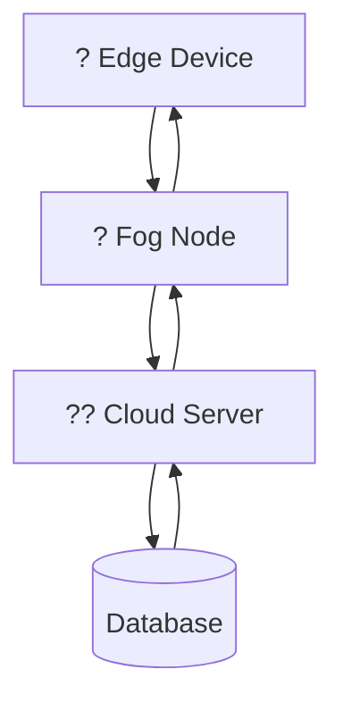
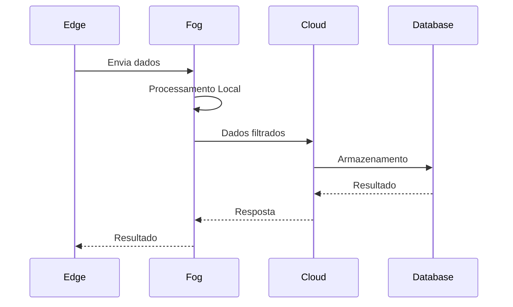
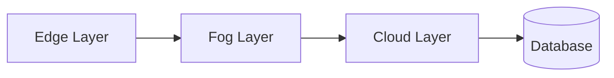
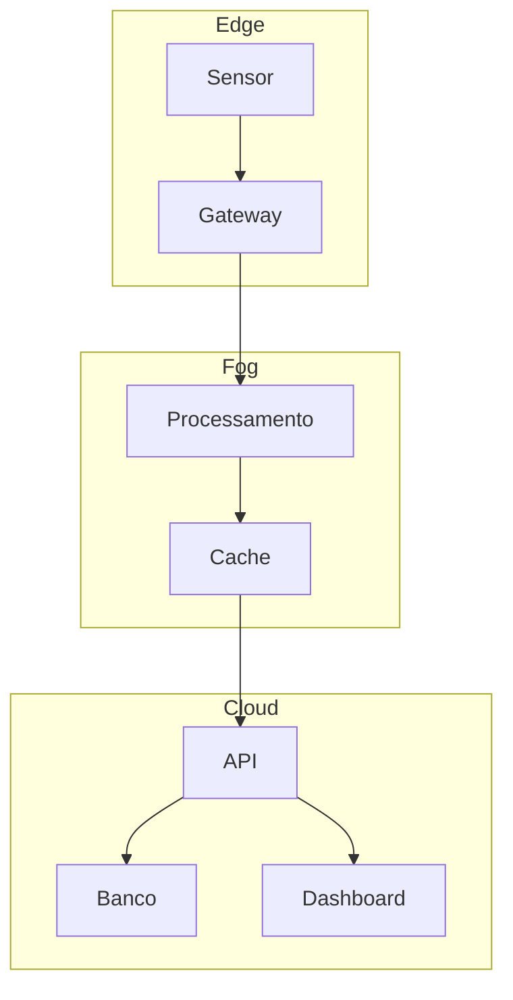

# ?? FogCloudEdge

<p align="center">


</p>

---

## ? Sobre o Projeto

Este projeto foi desenvolvido como parte das atividades da **Universidade do Vale do Rio dos Sinos (UNISINOS)**, com o objetivo de implementar uma arquitetura baseada em **Cloud Computing**, **Fog Computing** e **Edge Computing**.

A proposta demonstra como os dados podem ser processados em diferentes camadas da infraestrutura, reduzindo latência, melhorando desempenho e distribuindo a carga computacional.

---

# ? Índice

- [Arquitetura](#-arquitetura)
- [Tecnologias](#-tecnologias-utilizadas)
- [Estrutura do Projeto](#-estrutura-do-projeto)
- [Fluxo de Funcionamento](#-fluxo-de-funcionamento)
- [Instalação](#-instalação)
- [Execução](#-execução)
- [Resultados](#-resultados)
- [Roadmap](#-roadmap)
- [Autor](#-autor)
- [Licença](#-licença)

---

# ? Arquitetura



---

# ? Tecnologias Utilizadas

| Tecnologia | Descrição |
|------------|-----------|
| Python | Desenvolvimento principal |
| Docker | Containers |
| MQTT | Comunicação IoT |
| Flask/FastAPI | API |
| SQLite/MySQL | Banco de Dados |
| Linux | Ambiente de execução |
| Git | Versionamento |
| GitHub | Hospedagem |

---

# ? Estrutura do Projeto

```text
FogCloudEdge/
?
??? cloud/
?   ??? app.py
?   ??? ...
?
??? fog/
?   ??? fog_node.py
?   ??? ...
?
??? edge/
?   ??? sensor.py
?   ??? ...
?
??? database/
?
??? docs/
?
??? docker/
?
??? requirements.txt
?
??? README.md
```

---

# ? Fluxo de Funcionamento



---

# ? Instalação

Clone o repositório

```bash
git clone https://github.com/PedroEduardo68/Unisinos-FogCloudEdge.git
```

Entre na pasta

```bash
cd Unisinos-FogCloudEdge
```

Instale as dependências

```bash
pip install -r requirements.txt
```

---

# ? Execução

Exemplo:

```bash
python app.py
```

Ou utilizando Docker

```bash
docker compose up
```

---

# ? Arquitetura em Camadas



---

# ? Funcionalidades

- ? Coleta de dados
- ? Processamento na borda (Edge)
- ? Processamento intermediário (Fog)
- ? Processamento em nuvem (Cloud)
- ? Armazenamento de dados
- ? Comunicação entre camadas
- ? APIs
- ? Containers Docker

---

# ? Roadmap

- [x] Implementação da camada Edge
- [x] Implementação da camada Fog
- [x] Implementação da Cloud
- [x] Banco de Dados
- [ ] Dashboard Web
- [ ] Monitoramento em tempo real
- [ ] Testes automatizados

---

# ? Demonstração

Adicione aqui imagens do sistema.

```text
docs/
   arquitetura.png

docs/
   dashboard.png
```

ou

```markdown

```

---

# ? Exemplo da Arquitetura



---

# ??? Autor

**Pedro Eduardo**

GitHub:

https://github.com/PedroEduardo68

---

# ? Contribuição

Contribuições são bem-vindas!

1. Fork
2. Nova Branch

```bash
git checkout -b feature/minha-feature
```

3. Commit

```bash
git commit -m "Minha nova feature"
```

4. Push

```bash
git push origin feature/minha-feature
```

5. Pull Request

---

# ? Licença

Este projeto está licenciado sob a licença **MIT**.

---

<p align="center">

Desenvolvido com ?? na UNISINOS

</p>
