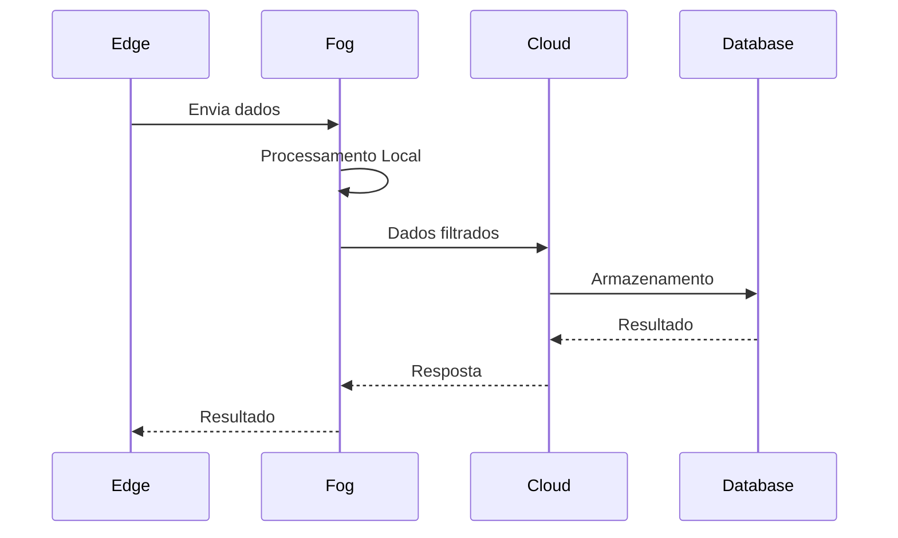

#  FogCloudEdge

<p align="center">


</p>

---

## Sobre o Projeto

Este projeto foi desenvolvido como parte das atividades da **Universidade do Vale do Rio dos Sinos (UNISINOS)**, com o objetivo de implementar uma arquitetura baseada em **Cloud Computing**, **Fog Computing** e **Edge Computing**.

A proposta demonstra como os dados podem ser processados em diferentes camadas da infraestrutura, reduzindo latência, melhorando desempenho e distribuindo a carga computacional.


---

#  Tecnologias Utilizadas

| Tecnologia | Descrição |
|------------|-----------|
| Docker | Containers |
| MQTT | Comunicação IoT |
| PostgresqL | Banco de Dados |
| Linux | Ambiente de execução |
| Git | Versionamento |
| GitHub | Hospedagem |

---


---

#  Fluxo de Funcionamento



---

#  Execução


Utilizando Docker

```bash
docker compose up
```

---


# Documentação de Dockerfiles e arquivos XML


**Backend (produção)**: [backend/Dockerfile-prod](backend/Dockerfile-prod#L1-L200)

- **Propósito**: Imagem de produção para o backend Node.js/Oracle/PHP.
- **Imagem base**: `pedroeduardo68/backoraclephpnode14:1`
- **Pontos-chave**:
  - Define `WORKDIR /backend` e copia todo o contexto.
  - Executa `RUN npm install package.json` (nota: comando incomum — normalmente `npm install` é usado).
  - `ENTRYPOINT ["npm", "start","--trace-warnings"]` inicia a aplicação.
- **Portas**: não expõe portas diretamente no Dockerfile.
- **Como buildar**:

  ```bash
  docker build -f backend/Dockerfile-prod -t backend-prod:latest .
  ```

---

**Frontend (produção)**: [Frontend/Dockerfile-prod](Frontend/Dockerfile-prod#L1-L200)

- **Propósito**: Servir a aplicação SPA via Nginx otimizado para SPAs.
- **Imagem base**: `steebchen/nginx-spa:stable`
- **Pontos-chave**:
  - Copia o diretório `./build/` para `/app` dentro da imagem.
  - Expõe `80` e executa `nginx` como comando padrão.
- **Portas**: `80`.
- **Como buildar**:

  ```bash
  docker build -f Frontend/Dockerfile-prod -t frontend-prod:latest .
  ```

---

**Imagem de infraestrutura - backend**: [docker/back-image/Dockerfile](docker/back-image/Dockerfile#L1-L200)

- **Propósito**: Imagem base de infraestrutura contendo Node.js v14 e cliente Oracle, usada para construir/rodar componentes do backend.
- **Imagem base**: `debian:bullseye`
- **Pontos-chave**:
  - Instala dependências via `apt-get` (libaio, build-essential, curl, wget, etc.).
  - Instala Node.js v14.18.1 a partir do tarball (cópia manual em /usr/local).
  - Verifica `node -v` e `npm -v`.
  - Instala cliente Oracle via `dpkg -i oracle-instantclient-basic_21.7.0.0.0-2_amd64.deb` (o .deb precisa estar no contexto de build).
  - Instala `php7.4` e `php7.4-pgsql`.
- **Observações / pontos de atenção**:
  - O Dockerfile assume que o pacote `.deb` do Instant Client já está presente no contexto de build.
- **Como buildar**:

  ```bash
  docker build -f docker/back-image/Dockerfile -t back-infra:latest docker/back-image
  ```

---

**Imagem de infraestrutura - frontend**: [docker/Front-Image/Dockerfile](docker/Front-Image/Dockerfile#L1-L200)

- **Propósito**: Imagem base para o frontend com Node.js v14 instalada manualmente.
- **Imagem base**: `debian:bullseye`
- **Pontos-chave**:
  - Instala ferramentas básicas (`curl`, `vim`, `ca-certificates`, `gnupg`, `xz-utils`).
  - Baixa e instala Node.js v14.18.1 a partir do tarball.
  - Verifica `node -v` e `npm -v`.
  - Comentário com exemplo de build: `docker build -t pedroeduardo68/frontendnode14:1 .` 
- **Como buildar**:

  ```bash
  docker build -f docker/Front-Image/Dockerfile -t front-infra:latest docker/Front-Image
  ```

---

## Ações recomendadas

- Verificar e padronizar o passo de instalação do Node.js (usar NodeSource ou `nvm` se apropriado).
- Remover ou ajustar o `RUN npm install package.json` no `backend/Dockerfile-prod` para `npm ci` ou `npm install` conforme o caso.
- Adicionar limpeza de cache do `apt` para reduzir tamanho das imagens.
- Incluir `EXPOSE` nos Dockerfiles que expõem portas de serviço para clareza.


## Docker Compose

Arquivo principal: [docker-compose.yml](docker-compose.yml#L1-L400)

- **Propósito**: Orquestrar serviços do sistema (banco de dados, broker MQTT, múltiplos frontends e backends, load balancers).
- **Serviços principais**:
  - **postgres**: `postgres:15` — variáveis de ambiente para usuário, senha e DB; volume host `/smartmeter/postgres-data` mapeado para persistência; porta `5432` exposta.
  - **mosquitto**: `eclipse-mosquitto:2.0` — configurações e volumes para dados e logs; portas `1883` (MQTT) e `9001` (Websocket) expostas. Usa `./docker/mosquitto/mosquitto.conf` como arquivo de configuração.
  - **frontend1..frontend4**: constrói a partir de `./frontend/smartweb/` usando `Dockerfile-prod`; cada instância mapeia portas `81..84` para `80` internamente (balanceadas por `nginxfrontend`).
  - **backend1, backend2**: constrói a partir de `./backend/` usando `Dockerfile-prod`; expõem `5001` e `5002` para `5000` interno; dependem de `postgres` e `mosquitto`; usam volumes de logs e arquivos em `/smartmeter/...`.
  - **backend_input**: serviço adicional do backend, mapeia `4001:4000`.
  - **nginxfrontend**: build em `./loadbalance/frontend/`, expõe `80` e `443`, depende dos quatro frontends.
  - **nginxbackend**: build em `./loadbalance/backend/`, expõe `5000` e `4000`, depende dos backends.

- **Volumes / Bind mounts**:
  - O compose usa vários bind mounts para `/smartmeter/...` (dados, logs, uploads). Esses caminhos são host-specific e exigem diretórios pré-existentes no host.

- **Variáveis sensíveis**:
  - As credenciais do Postgres são injetadas via variáveis de ambiente (`POSTGRES_USER_DC`, `POSTGRES_PASSWORD_DC`, `POSTGRES_DB_DC`). Recomenda-se usar um arquivo `.env` (não comitado) ou secrets para armazenamento seguro.

- **Como subir a stack (exemplo)**:

```bash
docker compose up -d --build
# logs: docker compose logs -f
# parar: docker compose down
```
 


<p align="center">

Desenvolvido com Pedro Camera  na UNISINOS

</p>


