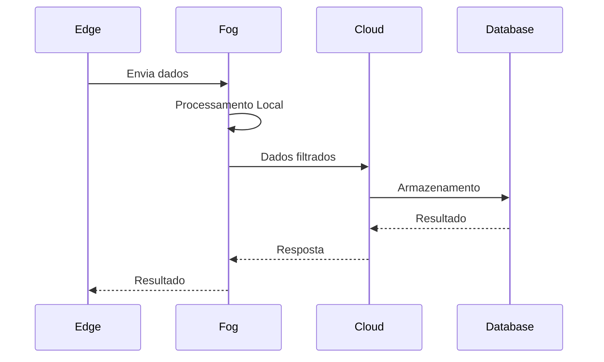

# ?? FogCloudEdge

<p align="center">


</p>

---

## ? Sobre o Projeto

Este projeto foi desenvolvido como parte das atividades da **Universidade do Vale do Rio dos Sinos (UNISINOS)**, com o objetivo de implementar uma arquitetura baseada em **Cloud Computing**, **Fog Computing** e **Edge Computing**.

A proposta demonstra como os dados podem ser processados em diferentes camadas da infraestrutura, reduzindo latência, melhorando desempenho e distribuindo a carga computacional.


---

# ? Tecnologias Utilizadas

| Tecnologia | Descrição |
|------------|-----------|
| Docker | Containers |
| MQTT | Comunicação IoT |
| PostgresqL | Banco de Dados |
| Linux | Ambiente de execução |
| Git | Versionamento |
| GitHub | Hospedagem |

---


---

# ? Fluxo de Funcionamento



---


# ? Execução


Utilizando Docker

```bash
docker compose up
```

---


<p align="center">

Desenvolvido com Pedro Camera  na UNISINOS

</p>
