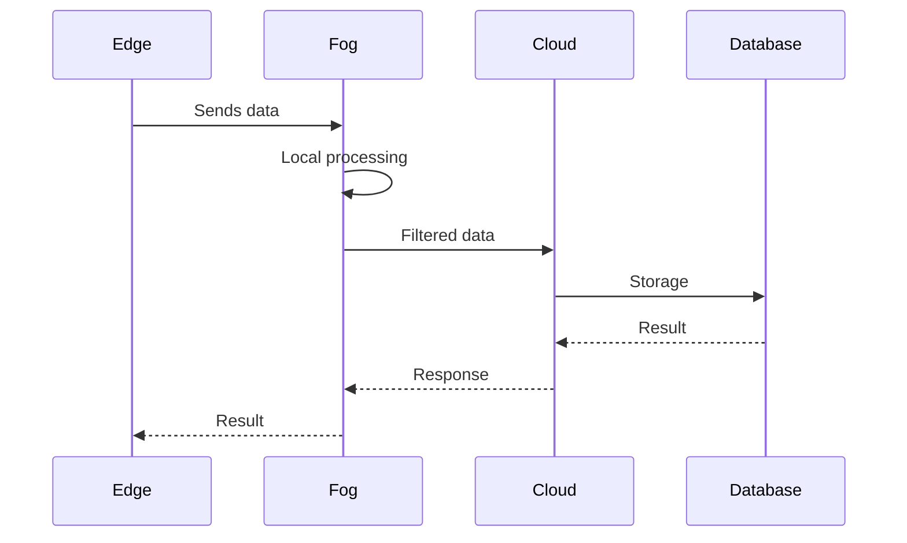

# FogCloudEdge

<p align="center">


</p>

---

## About the Project

This project was developed as part of activities at the **Universidade do Vale do Rio dos Sinos (UNISINOS)**. Its goal is to demonstrate an architecture based on **Cloud Computing**, **Fog Computing** and **Edge Computing**.

The proposal shows how data can be processed across different layers of the infrastructure, reducing latency, improving performance and distributing computational load.


---

# Technologies Used

| Technology | Description |
|------------|-------------|
| Docker | Containers |
| MQTT | IoT communication |
| PostgreSQL | Database |
| Linux | Runtime environment |
| Git | Version control |
| GitHub | Hosting |

---

---

# Operation Flow



---

# Running

Using Docker:

```bash
docker compose up
```

---

# Documentation of Dockerfiles and XML files

> Status: No XML files were found in the repository. The Dockerfiles identified are documented below.

---

**Backend (production)**: [backend/Dockerfile-prod](backend/Dockerfile-prod#L1-L200)

- **Purpose**: Production image for the backend (Node.js / Oracle / PHP).
- **Base image**: `pedroeduardo68/backoraclephpnode14:1`
- **Key points**:
  - Sets `WORKDIR /backend` and copies the build context.
  - Runs `RUN npm install package.json` (note: unusual — typically `npm install` is used).
  - `ENTRYPOINT ["npm", "start","--trace-warnings"]` starts the application.
- **Ports**: none declared in the Dockerfile.
- **How to build**:

  ```bash
  docker build -f backend/Dockerfile-prod -t backend-prod:latest .
  ```

---

**Frontend (production)**: [Frontend/Dockerfile-prod](Frontend/Dockerfile-prod#L1-L200)

- **Purpose**: Serve the SPA using an Nginx image optimized for single-page apps.
- **Base image**: `steebchen/nginx-spa:stable`
- **Key points**:
  - Copies `./build/` to `/app` inside the image.
  - Exposes port `80` and runs `nginx` by default.
- **Ports**: `80`.
- **How to build**:

  ```bash
  docker build -f Frontend/Dockerfile-prod -t frontend-prod:latest .
  ```

---

**Infrastructure image - backend**: [docker/back-image/Dockerfile](docker/back-image/Dockerfile#L1-L200)

- **Purpose**: Base infrastructure image containing Node.js v14 and Oracle client, used to build/run backend components.
- **Base image**: `debian:bullseye`
- **Key points**:
  - Installs dependencies via `apt-get` (libaio, build-essential, curl, wget, etc.).
  - Installs Node.js v14.18.1 from the tarball into `/usr/local`.
  - Verifies `node -v` and `npm -v`.
  - Installs Oracle Instant Client via `dpkg -i oracle-instantclient-basic_21.7.0.0.0-2_amd64.deb` (the .deb must be present in the build context).
  - Installs `php7.4` and `php7.4-pgsql`.

- **How to build**:

  ```bash
  docker build -f docker/back-image/Dockerfile -t back-infra:latest docker/back-image
  ```

---

**Infrastructure image - frontend**: [docker/Front-Image/Dockerfile](docker/Front-Image/Dockerfile#L1-L200)

- **Purpose**: Base image for the frontend with Node.js v14 installed manually.
- **Base image**: `debian:bullseye`
- **Key points**:
  - Installs basic tools (`curl`, `vim`, `ca-certificates`, `gnupg`, `xz-utils`).
  - Downloads and installs Node.js v14.18.1 from the tarball.
  - Verifies `node -v` and `npm -v`.
  - Contains a commented example build command: `docker build -t pedroeduardo68/frontendnode14:1 .`
 a
- **How to build**:

  ```bash
  docker build -f docker/Front-Image/Dockerfile -t front-infra:latest docker/Front-Image
  ```

---

## Recommended actions

- Standardize Node.js installation (use NodeSource or `nvm` if appropriate).
- Fix `RUN npm install package.json` in `backend/Dockerfile-prod` to use `npm ci` or `npm install` as appropriate.
- Add apt cache cleanup to reduce image size.
- Add `EXPOSE` to Dockerfiles that serve networked services for clarity.

---

## Docker Compose

Main file: [docker-compose.yml](docker-compose.yml#L1-L400)

- **Purpose**: Orchestrate system services (database, MQTT broker, multiple frontends/backends, load balancers).
- **Main services**:
  - **postgres**: `postgres:15` — environment variables for user/password/DB; host volume `/smartmeter/postgres-data` for persistence; port `5432` mapped.
  - **mosquitto**: `eclipse-mosquitto:2.0` — configuration and volumes for data and logs; ports `1883` (MQTT) and `9001` (WebSocket) mapped. Uses `./docker/mosquitto/mosquitto.conf`.
  - **frontend1..frontend4**: built from `./frontend/smartweb/` using `Dockerfile-prod`; each instance maps host ports `81..84` to internal port `80` (these are balanced by `nginxfrontend`).
  - **backend1, backend2**: built from `./backend/` using `Dockerfile-prod`; expose `5001` and `5002` on the host mapped to internal `5000`; depend on `postgres` and `mosquitto`; use host volumes for logs and files under `/smartmeter/...`.
  - **backend_input**: additional backend service mapping `4001:4000`.
  - **nginxfrontend**: built from `./loadbalance/frontend/`, exposes `80` and `443`, depends on the four frontends.
  - **nginxbackend**: built from `./loadbalance/backend/`, exposes `5000` and `4000`, depends on the backend services.

- **Volumes / Bind mounts**:
  - The compose file uses several host bind mounts under `/smartmeter/...` for data, logs and uploads. These are host-specific and require directories to exist with appropriate permissions.

- **Sensitive variables**:
  - Postgres credentials are injected via environment variables (`POSTGRES_USER_DC`, `POSTGRES_PASSWORD_DC`, `POSTGRES_DB_DC`). It is recommended to use a `.env` file (not committed) or Docker secrets to store sensitive values securely.

- **How to bring the stack up (example)**:

```bash
docker compose up -d --build
# view logs: docker compose logs -f
# stop: docker compose down
```

- **Improvement suggestions**:
  - Convert sensitive host bind mounts to named `volumes:` where possible for better portability.
  - Document required environment variables in a `.env.example` and recommend using Docker secrets for production.
  - Add `healthcheck` entries for critical services (Postgres, backend) and consider `depends_on` with health conditions, or use external orchestration for startup ordering.
  - Document the required host directories (`/smartmeter/...`) and necessary permissions.
  - Consider versioned images for load balancers and document the configuration located in `./loadbalance/`.

---

<p align="center">

Developed by Pedro Camera at UNISINOS

</p>
